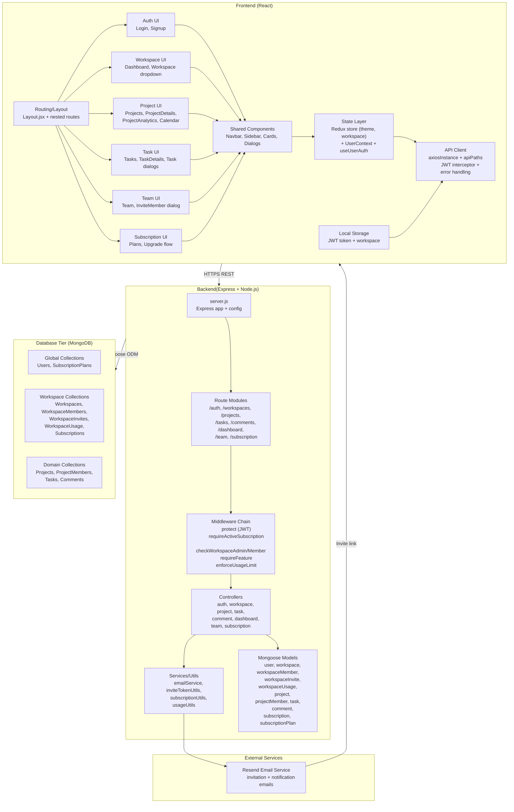
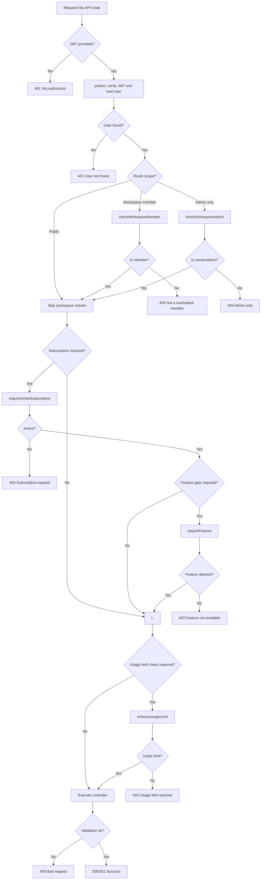
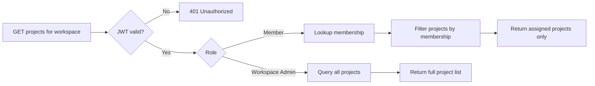
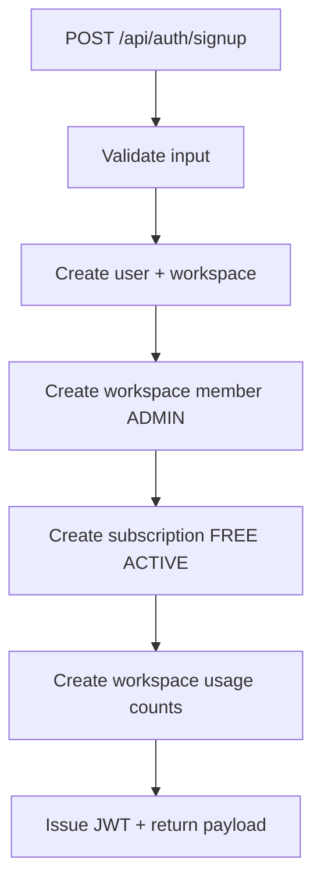
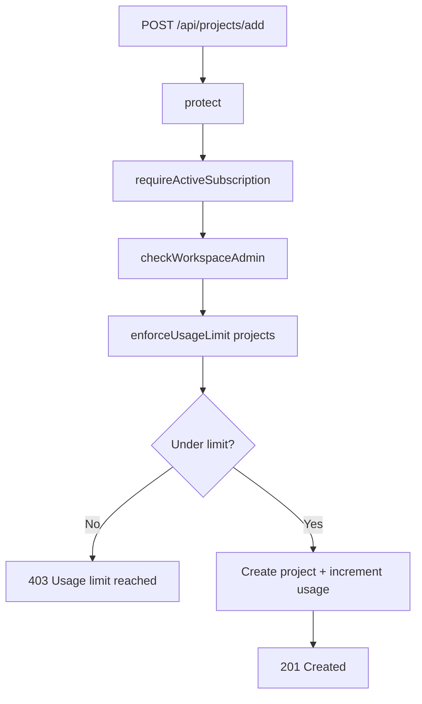
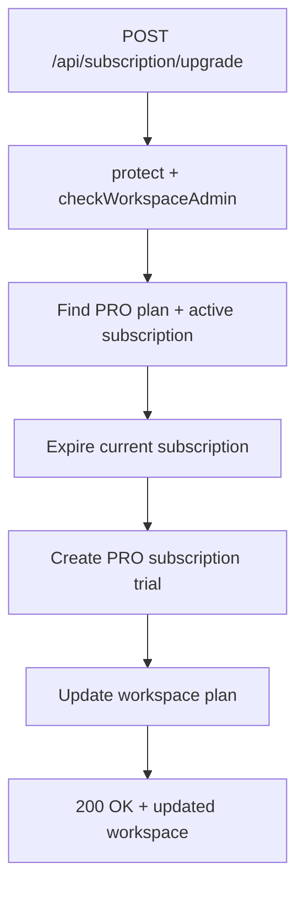
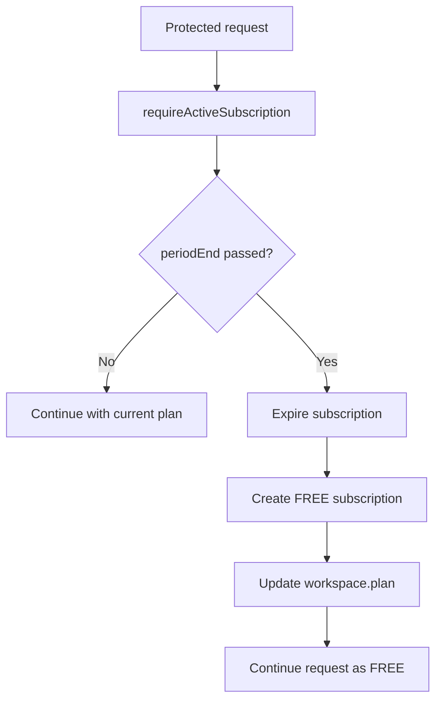
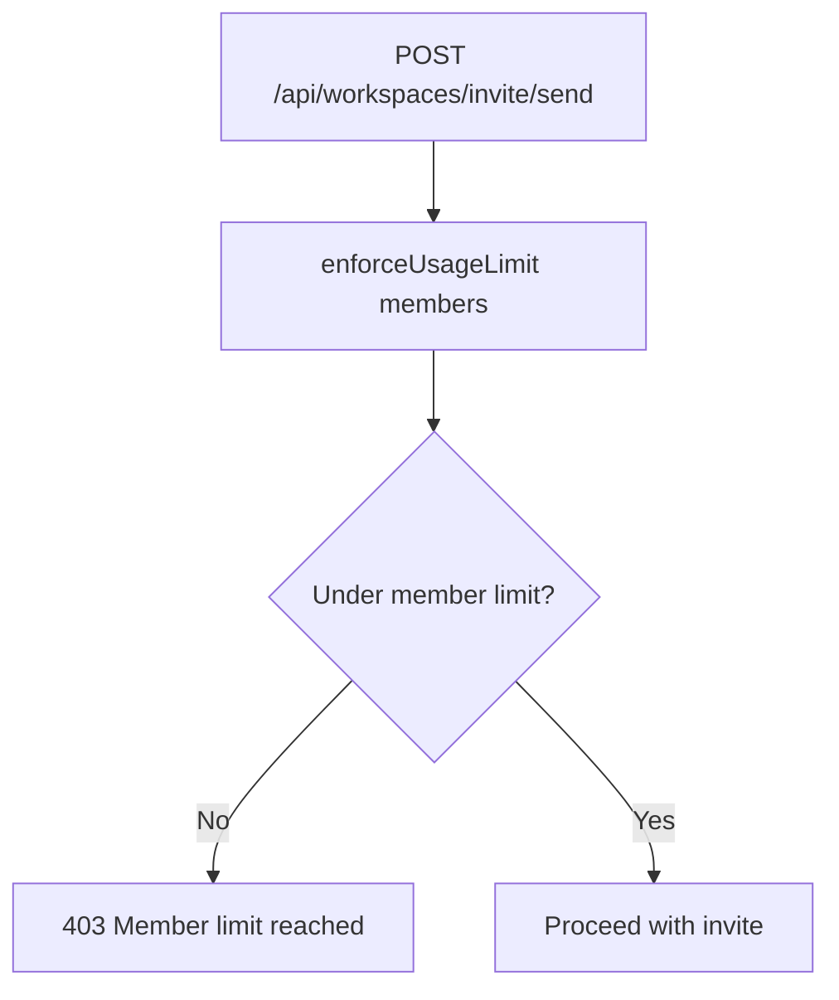
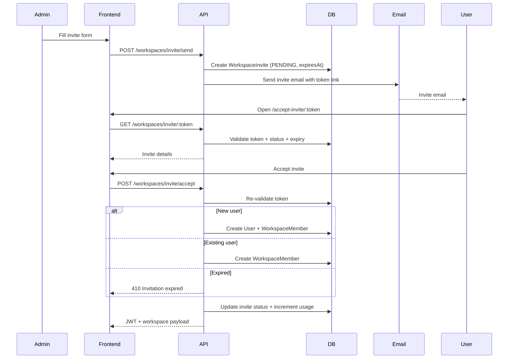
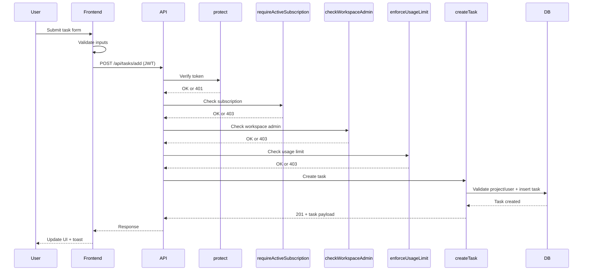

# Taskflow - Architecture & Flow Diagrams

---

## Table of Contents

1. [High-Level Architecture Diagram](#1-high-level-architecture-diagram)
2. [Entitlement Decision Flow Diagram](#2-entitlement-decision-flow-diagram)
3. [Permission Matrix](#3-permission-matrix)
4. [Data Access Flow (Admin vs Member)](#4-data-access-flow-admin-vs-member)
5. [Subscription & Usage Lifecycle](#5-subscription--usage-lifecycle)
6. [Email Invite & Acceptance Flow](#6-email-invite--acceptance-flow)
7. [Request-Response Cycle Example (Create Task)](#7-request-response-cycle-example-create-task)
8. [Key Architectural Principles](#8-key-architectural-principles)

## 1. High-Level Architecture Diagram



---

## 2. Entitlement Decision Flow Diagram



---

## 3. Permission Matrix

### Workspace-Level Permissions

| Capability | Owner/Admin | Member |
| --- | --- | --- |
| View workspace | ✅ | ✅ |
| Invite members | ✅ | ❌ |
| Remove members | ✅ | ❌ |
| Update workspace settings | ✅ | ❌ |
| Delete workspace | ✅ | ❌ |
| Upgrade/downgrade plan | ✅ | ❌ |

### Project-Level Permissions

| Capability | Workspace Admin/Project Lead | Project Member |
| --- | --- | --- |
| View project | ✅ | ✅ |
| Create project | ✅ | ❌ |
| Edit project details | ✅ | ❌ |
| Add/remove members | ✅ | ❌ |
| Delete project | ✅ | ❌ |
| View project tasks | ✅ | ✅ |

### Task-Level Permissions

| Capability | Workspace Admin | Task Assignee |
| --- | --- | --- |
| View task | ✅ | ✅ |
| Create task | ✅ | ❌ |
| Edit task | ✅ | ⚠️ own tasks only |
| Assign/reassign task | ✅ | ❌ |
| Delete task | ✅ | ❌ |
| Add comments | ✅ | ⚠️ if workspace member |
| Edit/delete own comments | ✅ | ✅ |

### Subscription-Level Permissions

| Capability | Workspace Admin | Member |
| --- | --- | --- |
| View available plans | ✅ | ✅ |
| Upgrade workspace plan | ✅ | ❌ |
| Access premium features | ⚠️ if plan allows | ⚠️ if plan allows |
| View subscription history | ✅ | ❌ |

---

## 4. Data Access Flow (Admin vs Member)



**Data safety controls**
- Workspace scope enforced on every query (`workspaceId` filter)
- Membership-based filtering for non-admins
- Role checks performed before any data access

---

## 5. Subscription & Usage Lifecycle

### Flow 1: User Signup (Bootstrap Workspace)



### Flow 2: Create Project (Usage Limit Gate)



### Flow 3: Upgrade Plan (FREE -> PRO)



### Flow 4: Auto-Downgrade on Expiration



### Flow 5: Member Limit Enforcement



---

## 6. Email Invite & Acceptance Flow



**Operational notes**
- Tokens are time-bound to prevent stale invites
- Usage limits are incremented only after acceptance

---

## 7. Request-Response Cycle Example (Create Task)



**Failure modes handled**
- 400 for validation issues
- 401 for missing/invalid token
- 403 for role, subscription, or usage limits

---

## 8. Key Architectural Principles

### 🔐 Security (Multiple Layers)
```
Request → JWT Verify → Role Check → Subscription Check → Feature Gate → Usage Limit
```
Each request passes through 4-6 security checks before reaching controller logic.

### 👥 Multi-Tenancy
- **Workspace-scoped data**: Projects, Tasks, Comments, Members isolated per workspace
- **Global shared data**: Users, Subscription Plans shared across system
- **Filtering**: All queries include workspaceId filter to prevent cross-tenant data access

### 💳 Subscription Model
- **FREE Plan**: 10 members max, unlimited projects/tasks
- **PRO Plan**:  Unlimited members, unlimited projects/tasks, 30-day demo period
- **Auto-manage**: Expired subscriptions automatically downgrade to FREE
- **Usage tracking**: Atomic increments prevent race conditions and double-counting

### 🎯 Role-Based Access Control
- **Workspace Level**: OWNER/ADMIN can manage settings, invite members, upgrade plan
- **Project Level**: ADMIN/LEAD can manage project, add members, create tasks
- **Task Level**: Creator/assignee can self-edit, admins can do anything
- **Feature Level**: Premium features locked unless plan allows

### 📧 User Onboarding
- **Email-first**: Users invited via email link (no direct signup required)
- **Token-based**: 7-day expiration prevents invite spam/abuse
- **Flexible**: Works for both new and existing users
- **Atomic**: Single POST prevents duplicate members

### 📊 Data Safety
- **Atomic operations**: Usage limits use MongoDB atomic $inc
- **Transactional**: User creation, workspace creation, subscription assignment in sequence
- **Validation**: Input validated at both frontend and backend
- **Idempotency**: Repeated requests don't create duplicates (token uniqueness)
